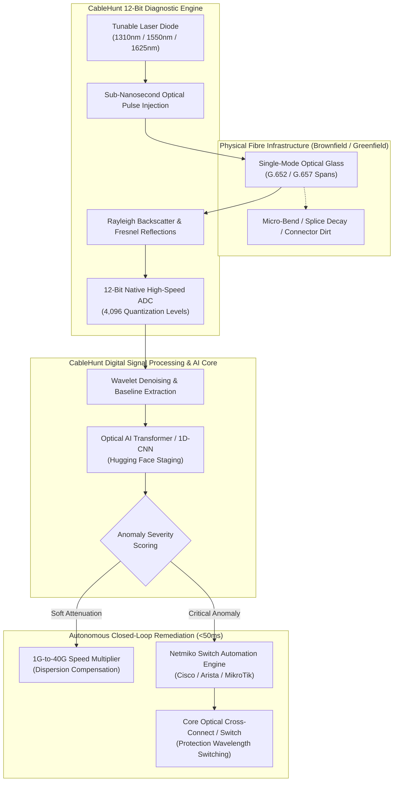

<div align="center">

# 🌐 CableHunt Networks Limited
### Autonomous Optical Fibre Diagnostics & 1G-to-40G Dynamic Brownfield Remediation
**A British Deep-Tech Innovation • UK Innovator Founder Framework**

[](https://github.com/sassil70/cablehunt/stargazers)
[-FFD21E?style=for-the-badge&logo=huggingface&logoColor=black)](https://huggingface.co/sassil70/cablehunt-optical-ai)
[-blueviolet?style=for-the-badge&logo=shield)](LICENSE.md)
[](https://www.cablehunt.co.uk)
[](https://www.cablehunt.co.uk)
[](https://sassil70.github.io/cablehunt/)
[](https://www.cablehunt.co.uk)

<br/>

[**Live Demo (GitHub Pages)**](https://sassil70.github.io/cablehunt/) • [**Official Portal**](https://www.cablehunt.co.uk) • [**Hugging Face AI Staging**](https://huggingface.co/sassil70/cablehunt-optical-ai) • [**Licensing Terms**](LICENSE.md) • [**Architecture**](#-technical-architecture) • [**Contact Executive Hub**](#-contact--executive-channels)

</div>

---

## 🌟 The Revolution: Transforming Optical Infrastructure

For over forty years, the physical layer of the world’s optical telecommunications and hyperscale data centres has remained **passive and reactive**. When a sub-millimetre micro-bend or connector decay occurs, detection requires expensive, manual truck rolls, passive 8-bit testers, and lengthy diagnostic outages. Furthermore, millions of kilometres of legacy single-mode glass remain constrained to 1G line-rates simply because physical recabling demands disruptive, multi-million-pound civil street excavation.

**CableHunt Networks Limited** shatters this paradigm by delivering:

1. **Sub-Millivolt 12-Bit Native Telemetry:** Elevating optical reflectometry from legacy 8-bit (256 discrete levels) to **12-bit native ADC (4,096 discrete levels)**—a **16× vertical resolution leap** that detects microscopic Rayleigh backscatter slopes and soft fiber decay before packet drop occurs.
2. **1G-to-40G Brownfield Speed Multiplier:** Upgrading brownfield optical glass from **1G to 40G line-rates** purely via software-driven dynamic chromatic dispersion compensation and ITU-T spectral allocation—**bypassing civil re-digging and slashing CapEx by up to 88%**.
3. **Sub-50ms Closed-Loop Network Self-Healing:** Autonomous physical-layer orchestration that interfaces directly with Cisco, Arista, and MikroTik core switches via Netmiko CLI/SSH pipelines, rerouting wavelengths and rebalancing optical amplifier gain in milliseconds.

```
+---------------------------------------------------------------------------------------------------+
|                                  THE CABLEHUNT PARADIGM SHIFT                                     |
+-----------------------------------+---------------------------------------------------------------+
| Legacy Optical Testing (1984-2024) | CableHunt Autonomous Telemetry (2026+)                        |
+-----------------------------------+---------------------------------------------------------------+
|  8-Bit Native ADC (256 levels)    |  12-Bit Native ADC (4,096 quantization steps - 16x precision) |
|  Passive diagnosis after outage   |  Active, real-time closed-loop physical self-healing (<50ms)  |
|  Excavation required for 40G      |  Zero-excavation 1G-to-40G brownfield line-rate multiplication|
|  Isolated truck rolls & paper PDF |  Unified Optical AI Agent + Direct Core Switch Netmiko API    |
+-----------------------------------+---------------------------------------------------------------+
```

---

## 🔬 Core Innovations & Technical Pillars

### 1. 🔬 12-Bit Native ADC Optical Reflectometer
* **Quantization Precision:** Conventional OTDR units utilize 8-bit analog-to-digital converters (256 discrete amplitude bins), leaving sub-millivolt Rayleigh backscatter obscured by quantization noise. CableHunt samples natively at **12-bit (4,096 discrete bins)**.
* **Sensitivity & Slope Dead Zones:** Resolves microscopic event dead zones down to **< 0.8 metres** and attenuation step variations down to **0.05 dB**, catching splice micro-strains, connector contamination, and localized hydrogen darkening.

### 2. ⚡ 1G-to-40G Brownfield Speed Multiplier
* **Bypassing Civil Excavation:** Instead of trenching roadways or re-pulling structured cabling (costing upwards of £120,000 per route kilometre in urban centres), CableHunt dynamically models the fiber transfer function $H(f)$.
* **Adaptive Spectral Allocation:** Optimizes launch power across ITU-T DWDM/CWDM spectral bands (1260nm to 1675nm: O, E, S, C, L, and U bands) to maintain high Optical Signal-to-Noise Ratio (OSNR) and low Bit Error Rates (BER) at 40 Gb/s over legacy single-mode spans.

### 3. 🌐 Closed-Loop Autonomous Physical Remediation
* **Zero-Human Intervention:** Moves network resilience beyond reactive SNMP alerts.
* **Automated Switch Orchestration:** Integrates Python-driven Netmiko/Paramiko pipelines with carrier-grade switches. When soft physical attenuation or anomalous reflection is verified by the diagnostic engine, automated protection switching triggers in **under 50 milliseconds**, preserving mission-critical SLA uptime.

### 4. 📟 Next-Gen Handheld Dual-Domain Diagnostic Unit
* **Integrated Modalities:** Combines dual-domain Time Domain Reflectometry (TDR) for copper/hybrid lines, 12-Bit Optical Time Domain Reflectometry (OTDR), Computer Vision ferrule inspection, and RF-over-Fiber (RFOF) testing in an industrial MICE-compliant handheld chassis.

---

## 🤖 Optical AI Foundation Model & Hugging Face Repository

We are building the world’s first specialized **Foundation Model for Optical Waveforms and Physical-Layer Network Health**.

### 🔗 Hugging Face Model Staging Hub
> **Model Repository:** [**https://huggingface.co/sassil70/cablehunt-optical-ai**](https://huggingface.co/sassil70/cablehunt-optical-ai)  
> **Maintainer Account:** [`sassil70`](https://huggingface.co/sassil70) / [`cabelhunt`](https://huggingface.co/cabelhunt)

### 🛡️ AI Model Safety, Security & Release Protocol
The neural model architectures (Time Series Transformer, 1D-CNN Wavelet Autoencoders, and Gaussian Digital-Twin Generators) are currently undergoing rigorous:
1. **Physical-Layer Safety Verification:** Ensuring automated switch commands never exceed Class 1M optical laser eye-safety power ceilings.
2. **Adversarial Robustness Testing:** Guarding switch CLI orchestration against spoofed reflection pulses and telemetry injection attacks.
3. **Telecommunication Security Compliance:** Verification against carrier-grade SOC2 and ITU-T physical-layer operational standards.

**The pre-trained model weights, SOR waveform tokenizers, and synthetic digital-twin dataset generators will be uploaded directly to the Hugging Face repository under the verified account as soon as safety protocols and certification procedures are finalized.**

---

## 📅 Open-Source Roadmap & Licensing Notice

```
                   OCTOBER 2026                          SEPTEMBER 2027
                         │                                     │
                         ▼                                     ▼
        ┌───────────────────────────────────┐        ┌───────────────────────────────────┐
        │     PRIVATE & RESEARCH ONLY       │  ===>  │     GLOBAL OPEN-SOURCE RELEASE    │
        │  Personal evaluation & lab testing │        │  Apache 2.0 / MIT Public License  │
        │     (No commercial distribution)  │        │   Open Community Contribution     │
        └───────────────────────────────────┘        └───────────────────────────────────┘
```

> ### 📢 Official Licensing Announcement
>
> 🗓️ **Target Open-Source Date:** **September 2027 (09/2027)**
>
> * **Pre-September 2027 Status:** This codebase, telemetry algorithms, and CAD assets are released for **Strictly Private, Personal, and Non-Commercial Research & Evaluation use only** (`للاستعمال الخاص والبحثي وليس للتوزيع أو النشر التجاري`).
> * **Redistribution Restrictions:** Unauthorized copying, public mirroring, sublicensing, or commercial deployment in revenue-generating carrier or enterprise environments is strictly prohibited prior to the official open-source date.
> * **Open-Source Transition:** Effective **September 30, 2027**, the core software suite will transition to an **Open-Source License** (Apache 2.0 / MIT with optical safety covenants) to empower global photonics and networking engineers.
>
> *See [LICENSE.md](LICENSE.md) for full terms.*

---

## 🏗️ Technical Architecture & Signal Pipeline



---

## 💻 Interactive Web Platform & Features

The repository includes the production-grade, responsive single-page web platform showcasing the full technology portfolio:

* **3D Photonic Wave Canvas:** Built with **Three.js**, visualizing coherent photon wave packet propagation through silica glass.
* **12-Bit vs 8-Bit Interactive Scope Slider:** Real-time visual comparison of legacy 8-bit stepped quantization vs CableHunt’s ultra-smooth 12-bit native curve.
* **Brownfield 40G ROI Calculator:** Real-time financial modeling estimating civil excavation CapEx savings across route kilometres.
* **Adaptive Spectrum Tuner:** Interactive ITU-T band allocation visualizer (1260nm to 1675nm).
* **Autonomous Optical AI Assistant:** Floating and on-page technical console powered by Gemini models, answering deep-tech optical engineering enquiries in British Technical English.

---

## 🚀 Quick Start & Local Execution

### 1. Clone the Repository
```bash
git clone https://github.com/sassil70/cablehunt.git
cd cablehunt
```

### 2. Configure Local Environment (Optional for AI Console)
If you wish to test the live Google Gemini-powered Optical AI Agent locally:
```bash
cp assets/js/config.example.js assets/js/config.js
# Edit assets/js/config.js with your Gemini API key:
# window.CABLEHUNT_CONFIG = { GEMINI_API_KEY: "YOUR_API_KEY_HERE" };
```
*(Note: `config.js` is automatically excluded by `.gitignore` to protect your credentials).*

### 3. Run Locally with Python HTTP Server
```bash
python -m http.server 8080
# Open your browser at http://localhost:8080
```

### 4. Run with Docker Container
```bash
# Build the production container
docker build -t cablehunt-web:latest .

# Run container on port 8080
docker run -d -p 8080:8080 --name cablehunt-instance cablehunt-web:latest

# Visit http://localhost:8080/healthz (returns OK)
```

---

## 🏛️ Executive Leadership & Corporate Governance

**CableHunt Networks Limited** is an endorsed British Deep-Tech enterprise registered under the laws of England and Wales.

* **UK Company House Registration No.:** 16093071
* **UK Authorised Endorsing Body:** Envestors Limited *(Regulated by the Financial Conduct Authority - FCA No. 07236828)*
* **Official Endorsement Reference:** `INF0021ENV2024`

### 👥 Leadership & Scientific Board
* **Eng. Salim Bassam Assil** — *Founding Systems Architect & Lead Optical Researcher*  
  Lead systems programmer, AI DSP pipeline architect, and 12-bit hardware designer.  
  Direct Email: [`assilno1@gmail.com`](mailto:assilno1@gmail.com) • [`saleem@cablehunt.co.uk`](mailto:saleem@cablehunt.co.uk) • [`saleem@cabelhunt.com`](mailto:saleem@cabelhunt.com)
* **Batoul Mowafak Zain Alabdin** — *Chief Executive Officer (CEO)*  
  Executive leadership, strategic alliances, financial governance, and investor relations.
* **Ahmad Jalal B Al Assil** — *Chief Operating Officer & Co-Founder (COO)*  
  Supply chain operations, UK regulatory compliance, and field pilot logistics.

---

## 📬 Contact & Executive Channels

We welcome technical dialogue, academic research collaborations, and scheduled demonstration visits to our engineering testbed:

* **Executive Office:** 3rd Floor, 45 Albemarle Street, Mayfair, London, W1S 4JL, United Kingdom
* **Registered Office:** 70 Colombo Street, London, SE1 8EE, United Kingdom
* **Engineering R&D Testbed:** Birmingham, West Midlands, United Kingdom
* **Central Inbound Enquiries:** [`info@cablehunt.co.uk`](mailto:info@cablehunt.co.uk)
* **Corporate & Carrier Partnerships:** [`partners@cablehunt.co.uk`](mailto:partners@cablehunt.co.uk)
* **Founder Direct Contacts:**
  - [`assilno1@gmail.com`](mailto:assilno1@gmail.com)
  - [`saleem@cablehunt.co.uk`](mailto:saleem@cablehunt.co.uk)
  - [`saleem@cabelhunt.com`](mailto:saleem@cabelhunt.com)
* **Official Website:** [https://www.cablehunt.co.uk](https://www.cablehunt.co.uk)

---

<div align="center">

### ⭐ Support the Open-Source Journey!
If you believe in the future of autonomous, self-healing optical physical-layer networks:  
**Please give this repository a Star ⭐ on GitHub!**  
Follow our progress as we prepare for the **September 2027 Open-Source Milestone** and upcoming Hugging Face model releases.

<br/>

*Copyright © 2023–2026 CableHunt Networks Limited. All rights reserved.*

</div>
